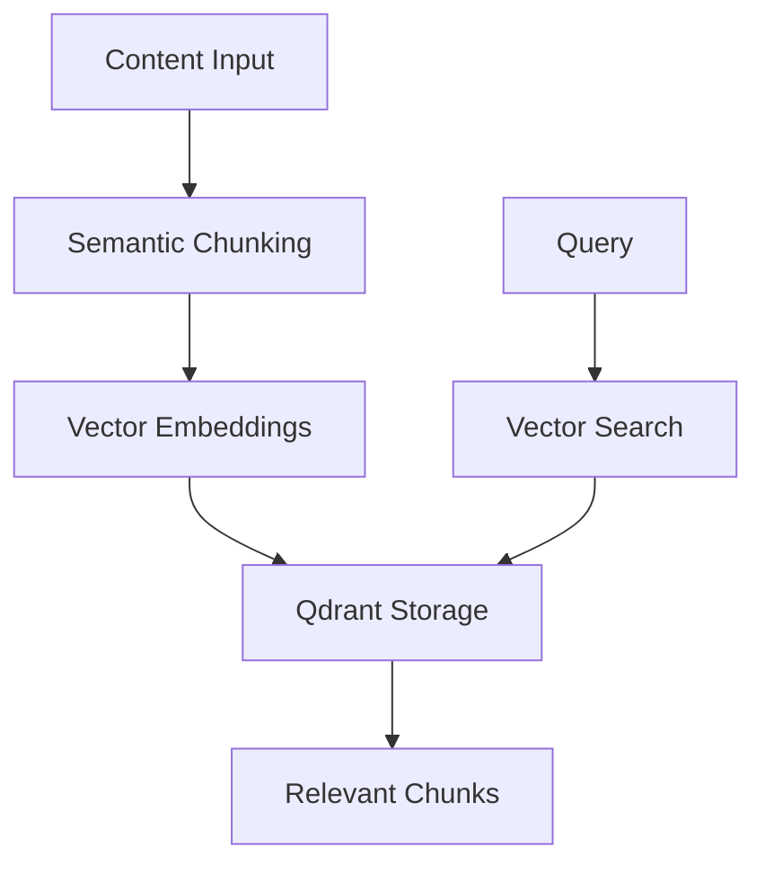

# b00t-grok: RAG Knowledgebase with Vector Database

🦀 A Rust library with Python bindings for semantic chunking and vector-based information retrieval using Qdrant and Ollama embeddings.

## ✅ Qdrant Integration Status

**Current Status**: ✅ **RESOLVED** - Integration tests passing with local Qdrant server!

- **Local Qdrant**: ✅ Both ports 6333 (HTTP) and 6334 (gRPC) enabled and working
- **Cloud Qdrant**: ⚠️ Still requires investigation (may need different client version)
- **Integration Tests**: ✅ Full workflow validation passing

**Key Discovery**: qdrant-client library requires port **6334** (Client API), not port 6333 (Web UI).

## Overview

b00t-grok implements a RAG (Retrieval Augmented Generation) knowledgebase system with the following components:

- **Semantic Chunking**: Intelligent text segmentation using the `chonkie` library
- **Vector Embeddings**: Text vectorization via Ollama's `nomic-embed-text` model
- **Vector Storage**: Qdrant vector database for similarity search
- **Production-Ready**: Structured error handling with recovery classification
- **Dual Interface**: Both Rust native library and Python bindings via PyO3

## Architecture



## Features

### Grok Verbs

- **`learn`**: Process documents into semantic chunks with embeddings
- **`digest`**: Store single content items with metadata
- **`ask`**: Retrieve relevant chunks using vector similarity search

### Error Handling

Production-ready error classification with:
- **Recoverable errors**: Network timeouts, connection failures
- **Configuration errors**: Missing environment variables, invalid settings
- **Validation errors**: Empty queries, oversized content
- **User-friendly messages**: Clear explanations without technical jargon

### Chunking Strategies

- **Semantic Chunker**: Advanced sentence-boundary chunking via Python `chonkie`
- **Basic Chunker**: Fallback paragraph-based splitting (no Python dependencies)

## Installation

### Prerequisites

1. **Qdrant Vector Database**: Requires both HTTP (6333) and gRPC (6334) ports
2. **Ollama**: For text embeddings with `nomic-embed-text` model
3. **Python Environment** (optional): For semantic chunking features

### Qdrant Setup

✅ **CONFIRMED WORKING**: qdrant-client v1.15.0 uses port 6334 for client operations.

Your Qdrant server must have both ports enabled:
```yaml
# docker-compose.yml
services:
  qdrant:
    image: qdrant/qdrant:v1.9.0
    ports:
      - "6333:6333"  # HTTP REST API (Web UI & manual testing)
      - "6334:6334"  # Client API (qdrant-client library) - REQUIRED
    volumes:
      - ./qdrant_storage:/qdrant/storage
```

Or start with Docker:
```bash
docker run -p 6333:6333 -p 6334:6334 qdrant/qdrant:v1.9.0
```

### Ollama Setup

Install Ollama and pull the embedding model:
```bash
# Install Ollama
curl -fsSL https://ollama.ai/install.sh | sh

# Pull embedding model
ollama pull nomic-embed-text
```

### Environment Configuration

Copy `.env.example` to `.env` and configure:

```env
# Qdrant Vector Database - HTTP REST API (port 6333)
QDRANT_URL=http://192.168.2.13:6333
QDRANT_API_KEY=

# Ollama Embeddings - Same server as Qdrant
OLLAMA_API_URL=http://192.168.2.13:11434
```

### Rust Library

Add to `Cargo.toml`:
```toml
[dependencies]
b00t-grok = { path = "./b00t-grok" }
# or with Python support:
b00t-grok = { path = "./b00t-grok", features = ["pyo3"] }
```

### Python Bindings

```bash
# Install Python dependencies
pip install maturin chonkie

# Build and install Python package
cd b00t-grok
maturin develop --features pyo3
```

## Usage

### Rust Library

```rust
use b00t_grok::{GrokClient, Result};

#[tokio::main]
async fn main() -> Result<()> {
    // Initialize client from environment variables
    let mut client = GrokClient::new(
        std::env::var("QDRANT_URL")?,
        std::env::var("QDRANT_API_KEY").unwrap_or_default()
    );
    
    // Initialize connections
    client.initialize().await?;
    
    // Learn from a document
    let chunks = client.learn(
        "rust_guide.md",
        "Rust is a systems programming language..."
    ).await?;
    
    println!("Learned {} chunks", chunks.len());
    
    // Ask questions
    let results = client.ask("What is Rust?", Some("rust")).await?;
    
    for chunk in results {
        println!("Match: {}", chunk.content);
    }
    
    Ok(())
}
```

### Python Bindings

```python
import b00t_grok
import json
import os

# Create client
client = b00t_grok.PyGrokClient(
    os.getenv("QDRANT_URL", "http://localhost:6333"),
    os.getenv("QDRANT_API_KEY", "")
)

# Learn from content
chunks_json = client.learn("python_guide.md", """
Python is a high-level programming language...
""")

chunks = [json.loads(c) for c in chunks_json]
print(f"Learned {len(chunks)} chunks")

# Ask questions
results_json = client.ask("What is Python?", "python")
results = [json.loads(r) for r in results_json]

for result in results:
    print(f"Match: {result['content']}")
```

### FastAPI MCP Server

Start the MCP-compatible server:

```bash
cd b00t-grok-py
uvicorn python.b00t_grok_guru.server:app --host 0.0.0.0 --port 8000
```

MCP endpoints:
- `POST /grok/learn` - Process documents
- `POST /grok/ask` - Query knowledge base
- `POST /grok/digest` - Store single items

## Error Handling

b00t-grok provides structured error handling with user-friendly messages:

```rust
use b00t_grok::{GrokClient, GrokError};

match client.ask("", None).await {
    Ok(results) => println!("Found {} results", results.len()),
    Err(e) => {
        println!("Error category: {}", e.category());
        println!("Is recoverable: {}", e.is_recoverable());
        println!("User message: {}", e.user_message());
        
        if e.is_recoverable() {
            // Retry logic here
            tokio::time::sleep(Duration::from_secs(1)).await;
            // retry...
        }
    }
}
```

### Error Categories

| Category | Description | Recoverable | Examples |
|----------|-------------|-------------|----------|
| `database` | Qdrant connection/operation failures | ✅ | Network timeouts, server unavailable |
| `embedding` | Ollama embedding generation | ✅ | API timeouts, model loading |
| `configuration` | Environment/setup issues | ❌ | Missing QDRANT_URL |
| `validation` | Input validation | ❌ | Empty queries, oversized content |
| `initialization` | Client setup | ❌ | Client not initialized |

## Development

### ⚠️ IMPORTANT: Use the justfile for all development tasks

The project uses a `justfile` for standardized development workflows. **Always use `just` commands** instead of raw `cargo` to ensure proper environment loading:

```bash
# List all available commands
just

# Development workflow (recommended)
just dev

# Run tests with proper direnv environment loading
just test-all

# Integration tests only (loads .envrc automatically)
just test-integration

# Check environment variables
just env

# Test server connectivity
just test-qdrant
just test-ollama
```

### Manual Testing (NOT RECOMMENDED)

If you must run tests manually, you need direnv:

```bash
# Load environment first
eval "$(direnv export bash)"

# Then run tests
cargo test --test integration_tests --no-default-features -- --nocapture
```

**⚠️ Integration tests require .envrc environment variables and will fail without proper loading.**

### Building Python Bindings

```bash
# Use justfile commands (recommended)
just python-build
just python-release

# Manual (not recommended)
maturin develop --features pyo3
maturin build --features pyo3 --release
```

## Deployment

### Docker Compose

```yaml
version: '3.8'
services:
  qdrant:
    image: qdrant/qdrant:v1.9.0
    ports:
      - "6333:6333"  # HTTP REST API
      - "6334:6334"  # Client API (REQUIRED)
    volumes:
      - qdrant_storage:/qdrant/storage
      
  ollama:
    image: ollama/ollama:latest
    ports:
      - "11434:11434"
    volumes:
      - ollama_models:/root/.ollama
    environment:
      - OLLAMA_HOST=0.0.0.0
      
  grok-server:
    build: ./b00t-grok-py
    ports:
      - "8000:8000"
    environment:
      - QDRANT_URL=http://qdrant:6333
      - OLLAMA_API_URL=http://ollama:11434
    depends_on:
      - qdrant
      - ollama

volumes:
  qdrant_storage:
  ollama_models:
```

### Production Checklist

- [ ] Qdrant server with both ports 6333 and 6334 enabled
- [ ] Ollama with `nomic-embed-text` model pulled
- [ ] Environment variables configured
- [ ] Network connectivity between services
- [ ] Proper error monitoring and logging
- [ ] Resource limits and scaling configuration

## Troubleshooting

### Common Issues

**❌ "protocol error: invalid compression flag"**
```
Solution: Enable gRPC port 6334 on Qdrant server
```

**❌ "OLLAMA_API_URL environment variable required"**
```
Solution: Set OLLAMA_API_URL=http://your-ollama-host:11434
```

**❌ "Failed to import chonkie library"**
```
Solution: pip install chonkie (for semantic chunking)
```

**❌ "Collection operation failed"**
```
Solution: Check Qdrant server status and network connectivity
```

### Debug Mode

Enable detailed logging:
```rust
use tracing_subscriber;

tracing_subscriber::fmt::init();

// Now client operations will log detailed information
```

## Contributing

1. Follow Rust best practices and run `cargo clippy`
2. Add tests for new features
3. Update documentation for API changes
4. Use structured error handling with `GrokError`
5. Ensure compatibility with both Rust and Python interfaces

## License

This project is part of the b00t ecosystem. See the main repository for license details.