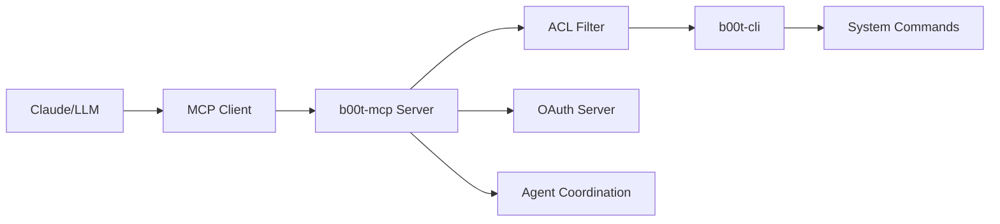

# b00t-mcp

🥾 MCP (Model Context Protocol) server for b00t-cli command proxy with ACL filtering

## Installation

### Quick Install

```bash
# Install globally with npm
npm install -g b00t-mcp

# Or use with npx (no installation needed)
npx b00t-mcp --help

# Or use with bunx (if you have bun)
bunx b00t-mcp --help
```

### Alternative Installation Methods

```bash
# Install from Rust source (requires cargo)
cargo install --git https://github.com/elasticdotventures/dotfiles b00t-mcp

# Build from source
git clone https://github.com/elasticdotventures/dotfiles.git
cd dotfiles
cargo build --release --package b00t-mcp
```

## Usage

```bash
# Start MCP server
b00t-mcp

# Show help
b00t-mcp --help

# Run with specific configuration
b00t-mcp --config /path/to/config.toml

# Enable debug logging
RUST_LOG=debug b00t-mcp
```

## Configuration

b00t-mcp uses TOML configuration files. Example configuration:

```toml
[server]
host = "127.0.0.1"
port = 3456

[acl]
allow_list = ["safe-command", "read-*"]
deny_list = ["rm", "sudo"]

[tools]
b00t_cli_path = "/usr/local/bin/b00t-cli"
```

## Features

- **MCP Server**: Full Model Context Protocol server implementation
- **ACL Filtering**: Access control lists for command safety
- **b00t Integration**: Seamless integration with b00t-cli tools
- **Cross-platform**: Supports Linux, macOS, and Windows
- **OAuth Support**: GitHub OAuth authentication
- **Agent Coordination**: Multi-agent communication protocols

## Architecture



## Development

This package provides pre-compiled binaries for multiple platforms. The binaries are built from the Rust source code in the [dotfiles repository](https://github.com/elasticdotventures/dotfiles).

### Supported Platforms

- Linux x64/ARM64
- macOS x64/ARM64 (Intel/Apple Silicon)
- Windows x64/ARM64

### Environment Variables

- `RUST_LOG`: Set logging level (debug, info, warn, error)
- `B00T_CONFIG_PATH`: Override default config file location
- `B00T_MCP_PORT`: Override default port

## License

MIT License - see [LICENSE](https://github.com/elasticdotventures/dotfiles/blob/main/LICENSE)

## Links

- [Source Code](https://github.com/elasticdotventures/dotfiles/tree/main/b00t-mcp)
- [Documentation](https://github.com/elasticdotventures/dotfiles/tree/main/b00t-mcp)
- [Issues](https://github.com/elasticdotventures/dotfiles/issues)
- [b00t Framework](https://github.com/elasticdotventures/dotfiles)

---

🎂 Built with love by the [PromptExecution](https://promptexecution.com) team